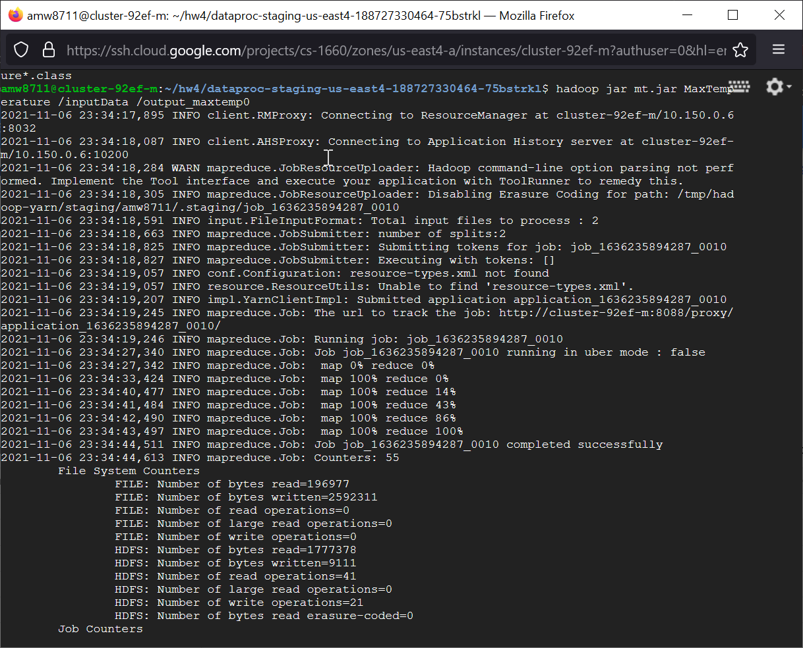
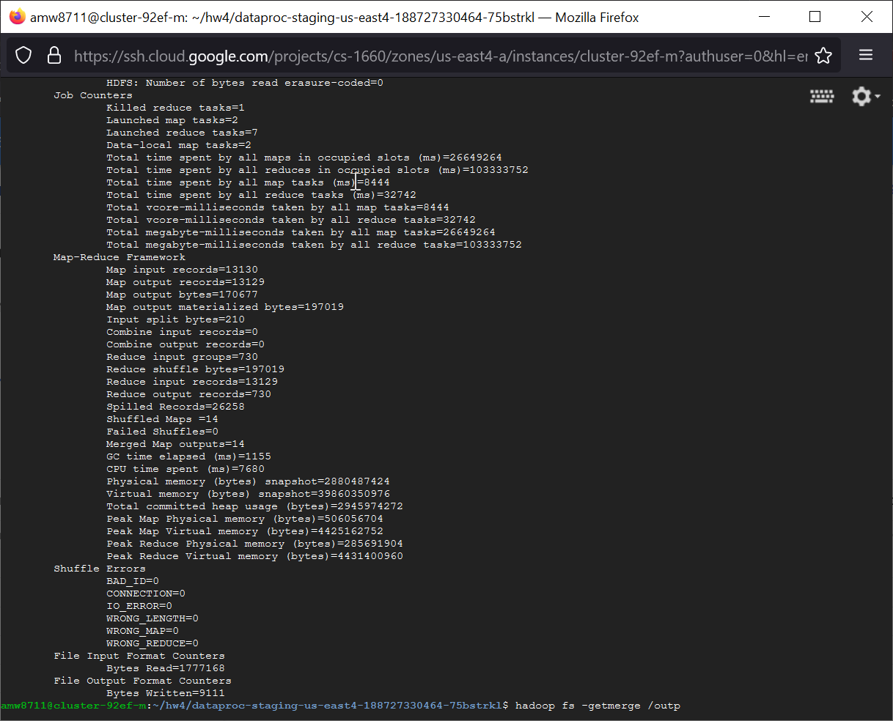

# CS1660_HW4
University of Pittsburgh CS 1660 Cloud Computing Homework 4 involving Hadoop, MapReduce, and Google Cloud Platform

## Contents

- The Mapper code is found in [MaxTemperature.java](Docker/MaxTemperature.java) as the MaxTemperatureMapper class. 
- The Reducer code is found in [MaxTemperature.java](Docker/MaxTemperature.java) as the MaxTemperatureReducer class. 
- The combined output of the MapReduce job is found in [output.txt](Docker/MaxTemperature.java).
- The screenshots of the execution are [MapReduceExecution1.png](Docker/MapReduceExecution1.png) and [MapReduceExecution2.png](Docker/MapReduceExecution2.png) and are also seen below.

## Screenshots of Hadoop MapReduce Job

